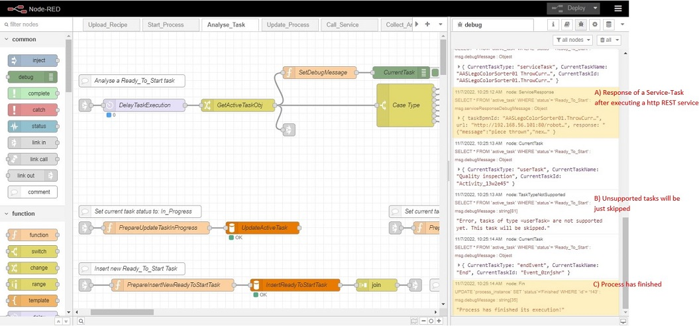
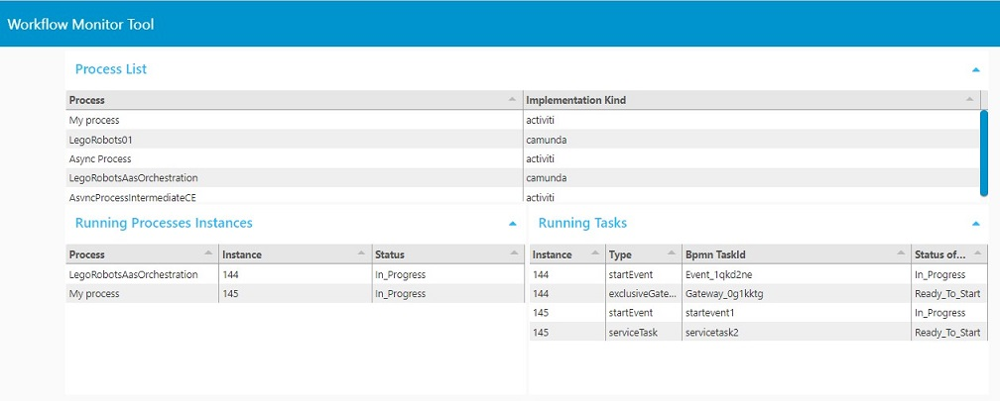

# NodeRed Workflow Manager (NodeRed WM)
NodeRed WM is an approach to workflow management system for embedded devices using [Node-RED](http://nodered.org) for implementation, selection, and execution of BPMN files. See architecture and modules in WorkflowManager.pptx

# Requirements
1. Node-RED: Core of this tool. Any version can be used.
2. node-red-dashboard: A node-red node neccessary for the workflow monitor tool. Install it under the ```Manage Palette``` menu.
3. MySql database: Workflow recipe repository. Any version can be used.

# Installation steps
1. Create database structure by executing the database script [/DB/process.sql](/DB/process.sql).
2. Import the flows in Node-RED [/NodeREDFlows/AllFlows.json](/NodeREDFlows/AllFlows.json)
3. [Context Analyzer](https://github.com/MUFacultyOfEngineering/ContextAnalyzer): This is optional if you want to validate context for service re-selection at process runtime. See installation steps in the link provided.

# Test it
Bpmn workflow recipes are provided under the [/BPMNFlows/](/BPMNFlows/) folder, some of those recipes are written in Camunda and Activiti (WSO2).
1. Upload any .bpmn recipe using the endpoint ```http://localhost:1880/upload_recipe``` set the actual xml as raw request body.
2. Execute any process by using the endpoint ```http://localhost:1880/start_process?processname={YourProcessName}```. 
- 2.1 Optional parameters: 
	- ```delayTaskExecution```: int parameter to delay execution of each task in milliseconds. It is ```0``` by default.
	- ```validateContext```: boolean parameter to indicate whether the Node-RED WM should validate context for service re-selection during execution. It is ```false``` by default.
3. You can monitor the execution by looking at the debug panel in Node-RED or using our Workflow Monitor Tool
- Node-RED's debug panel



- Worflow Monitor Tool ```http://localhost:1880/ui```



# Compatibility
1. NodeRed WM has been tested using recipes created in Camunda and WSO2 Integration Studio 8.0.0. 
2. Multiple processes can be started simultaneously.
3. List of supported task types: 
- StartEvent
- EndEvent
- ServiceTask
- ParallelGateway
- ExclusiveGateway
- IntermediateCatchEvent

When NodeRed WM tries to execute an unsupported task type, it will be just set as finished and the process will continue its execution.

# Under development
The project is still under development at this moment. Many functionalities may be developed for specific use-cases and not fully compatible for all scenarios yet.

# Authoring
Developed at [Mondragon Unibertsitatea](https://www.mondragon.edu/) during the participation of the European project [**Arrowhead Tools**](https://www.arrowhead.eu/arrowheadtools).

Main developers:
- [Alain Perez Riaño](https://www.mondragon.edu/en/bachelor-degree-computer-engineering/lecturers/-/profesor/alain-perez-riano)
- [Felix Larrinaga Barrenechea](https://www.mondragon.edu/en/bachelor-degree-computer-engineering/lecturers/-/profesor/felix-larrinaga-barrenechea)
- William Steven Ochoa Agurto
